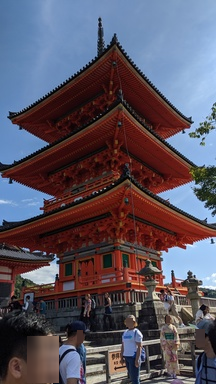

# Background_Face_Privacy 

Project to detect faces in the background of photos and blur the faces to allow for privacy of individuals.

Usage:
-------------

python3 face_detect.py -i [input_images_directory]

By default the algorithm will use the YOLOv3 algorithm to detect faces and apply a blur onto them. To use the haar cascades version, which is less accurate but faster.

An example input image can be seen below:

The output of the image can be seen here:

To run type the following:

python3 face_detect.py -i [input_image_directory] -d 0

For additional options on the arguments used in the program run:

python3 face_detect.py -h

Requirements:
--------------

Requires a config file and weights file that were trained on a face dataset.

These can be downloaded from:
https://github.com/sthanhng/yoloface

Grab the following files from the yoloface repository:

Face weights for yolov3:
- yolov3-wider_16000.weights   (this can be found in the README, look under the Usage section)

Then get the config file from:
- https://github.com/sthanhng/yoloface/blob/master/cfg/yolov3-face.cfg

Python Version and OS used:
--------------

- Python 3.7.4
- Ubuntu 18.04LTS

Please let me know if you have any questions! :)
